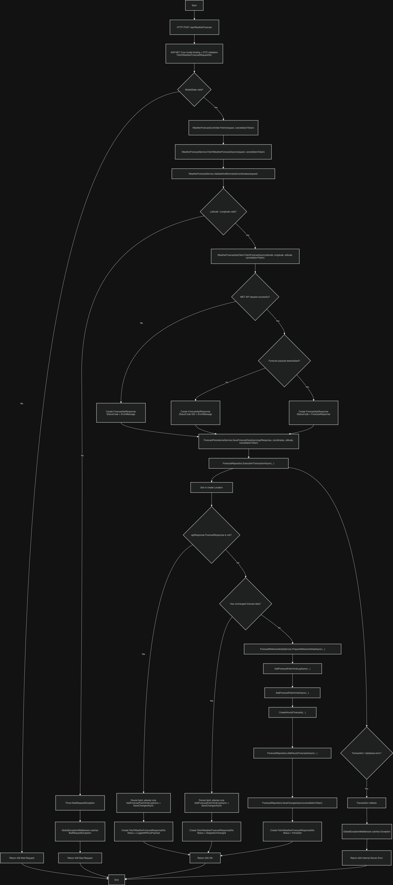
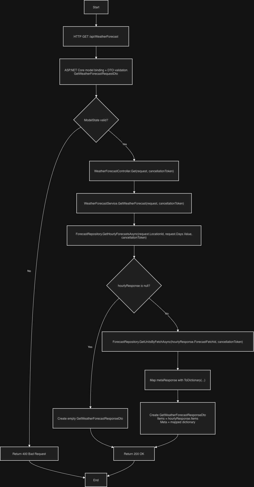
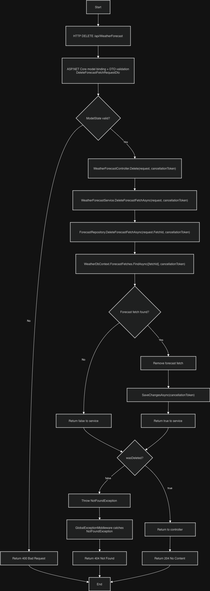

# Weather App

### Flow Diagrams

Below are the flow diagrams for the implemented weather API endpoints.

#### 1. Fetch Forecast Flow
This diagram shows the flow for fetching forecast data from the external yr.no API, processing the response, and saving the result to the database.

#### 2. Get Forecast From Database Flow
This diagram shows the flow for retrieving hourly forecast data from our database together with metadata needed for frontend display.

#### 3. Delete Forecast Fetch Flow
This diagram shows the flow for deleting a forecast fetch record and handling the not-found scenario.

